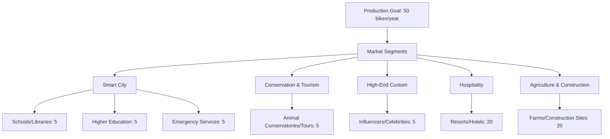

# Innovative E-Bike Partnership Opportunity: Smart Cities to Scalable Production

# Table of Contents

- [Executive Summary](#executive-summary)
  - [Key Highlights](#key-highlights)
- [Our Team](#our-team)
- [Unique Value Proposition](#unique-value-proposition)
- [Production and Distribution Plan](#production-and-distribution-plan)
- [Strategic Objectives](#strategic-objectives)
- [Long-term Vision](#long-term-vision)
- [Partnership Opportunities](#partnership-opportunities)
- [Next Steps](#next-steps)
- [Appendix: Strategies for Securing Commitments and Funding](#appendix-strategies-for-securing-commitments-and-funding)

## Executive Summary

We're seeking strategic partners, collaborators, and investors for our cutting-edge e-bike platform that combines smart city integration, advanced technology, and scalable production capabilities.

### Key Highlights:
- Innovative e-bike platform with ADAS technology and smart city integration
- Scalable production: 50 bikes/year, expandable to 500/year
- Global supply chain leveraging premium Taiwanese and Shenzhen manufacturers
- Versatile platform serving multiple markets and use cases

## Our Team
- 4+ years in remote project management for solar projects across Western Canada
- In-house R&D through Nikola Labs electrical engineering facility
- Collaboration with University of Windsor, Gates Corp, and APMA on next-gen charging and battery management
- Extensive experience in IoT and embedded systems design

## Unique Value Proposition
1. **Smart City Integration**: E-bikes double as mobile urban sensors, detecting infrastructure issues and integrating with city systems.
2. **Advanced Driver-Assistance Systems (ADAS)**: Bringing car-level safety features to two-wheelers.
3. **Versatile Platform**: Serving markets from farm utility to urban delivery services.
4. **Research Ready**: Designed for easy integration of additional sensors and electronics.

## Production and Distribution Plan

| Market Segment | Target Quota | Use Case | Content Strategy | Prospect/Lead/Committed |
|----------------|--------------|----------|------------------|-------------------------|
| Smart City - Schools / Public Libraries | 5 | Community maintenance education accessibility | Showcase community impact educational integration | Local government school boards |
| Smart City - Higher Education | 5 | Engineering R&D campus bike-share student safety | Highlight innovation sustainability on campus | Universities colleges |
| Smart City - Emergency Services | 5 | Fire Police Forestry EMS work bikes | Document real-life use cases efficiency improvements | Municipal departments |
| Conservation & Tourism | 5 | Animal conservatories bird watching guided tours | Create viral marketing content eco-friendly initiatives | NGOs tour companies |
| High-End Custom | 5 | Influencer collaborations celebrity endorsements | Luxury lifestyle showcases exclusive events | Social media influencers athletes celebrities |
| Hospitality | 20 | Luxury resorts eco-lodges urban hotels | Co-branded experiences rental programs | Hotel chains boutique resorts |
| Agriculture & Construction | 20 | Farm operations construction site mobility | Demonstrate durability load capacity cost savings | Agribusinesses construction companies |

## Long-term Vision

Our ambitious long-term vision is to revolutionize the two-wheeler market, particularly in South Asia, through innovative technology and strategic partnerships:

1. **Market Leadership**: Become the leading tier 1 supplier for controllers and Advanced Driver-Assistance Systems (ADAS) in the South Asian two-wheeler market.
   - Projected market size: 32 million units annually by 2030
   - Target to capture 15-20% market share within 5 years of full-scale production

2. **Technological Innovation**:
   - Continual development of cutting-edge ADAS features for two-wheelers
   - Integration of AI and machine learning for predictive maintenance and enhanced rider safety
   - Expansion of IoT capabilities for seamless smart city integration

3. **Manufacturing Excellence**:
   - Scale production from initial 50 bikes/year to 10,000+ annually within 5 years
   - Establish state-of-the-art manufacturing facilities in key South Asian markets
   - Implement Industry 4.0 practices for efficient and sustainable production

4. **Strategic Partnerships**:
   - Leverage existing partnership with key prototype manufacturer in Bangalore
   - Expand collaborations with major brands like Bajaj, TVS, and Hero Honda
   - Foster relationships with tech giants for advanced software integration

5. **Global Expansion**:
   - Use South Asian market as a springboard for entering other emerging markets
   - Adapt technology and business model for different regional requirements
   - Establish a global brand recognized for innovation and reliability in e-mobility

6. **Sustainability Leadership**:
   - Become a benchmark for sustainable manufacturing in the automotive industry
   - Develop closed-loop recycling systems for e-bike components
   - Contribute significantly to urban decarbonization efforts worldwide

By focusing on these key areas, we aim to not only lead the e-mobility revolution in South Asia but also set new global standards for sustainable, smart, and safe urban transportation.
## Long-term Vision
- Become the leading tier 1 supplier for controllers and ADAS in the South Asian two-wheeler market
- Projected market size: 32 million units annually by 2030
- Existing partnership with key prototype manufacturer in Bangalore

## Partnership Opportunities
We're seeking partners who:
- Have compelling use cases for smart, connected e-bikes
- Can support our production goals and vision for agile manufacturing
- Are interested in entering or expanding in the South Asian e-mobility market
- Want to collaborate on pioneering ADAS for two-wheelers

## Next Steps
We invite you to schedule a 30-minute video call to explore potential synergies and discuss how our technology and scalable production model can align with your strategic goals.

## Appendix: Strategies for Securing Commitments and Funding
1. Secure Letters of Intent (LOI) and Memoranda of Understanding (MOU)
2. Highlight sustainability and environmental impact
3. Emphasize job creation and local economic impact
4. Showcase technology innovations and R&D roadmap
5. Outline partnerships and collaborations
6. Detail scalability plan
7. Provide financial projections and ROI calculations
8. Define social impact metrics
9. Present risk assessment and mitigation strategies
10. Establish clear timeline and milestones
