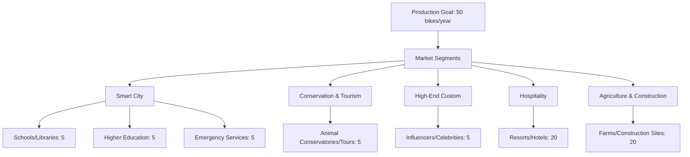

# Innovative E-Bike Partnership Opportunity: Smart Cities to Scalable Production

*Figure 1: Our customized e-bike prototype, showcasing adaptability for various use cases*

*Figure 2: Our team with the latest e-bike prototype at the University of Windsor research facility*

## Table of Contents

- [Executive Summary](#executive-summary)
- [Our Team](#our-team)
- [Unique Value Proposition](#unique-value-proposition)
- [Production and Distribution Plan](#production-and-distribution-plan)
- [Long-term Vision](#long-term-vision)
- [Partnership Opportunities](#partnership-opportunities)
- [Next Steps](#next-steps)
- [Appendix: Strategies for Securing Commitments and Funding](#appendix-strategies-for-securing-commitments-and-funding)

## Executive Summary

We have developed a cutting-edge electric two-wheeler platform that seamlessly integrates with smart city infrastructure. Our platform features:

- Advanced embedded electronics
- Custom-designed speed controller
- Electronic motor
- RISC-V based infotainment system
- Next-generation alloys and carbon fiber construction

We are transitioning from research to small-scale production, aiming to scale our technology and demonstrate real-world applications. We seek strategic partners, collaborators, and investors to bring this innovative platform to market.

### Key Highlights:
- 🚲 Innovative e-bike platform with in-house ADAS technology
- 🏙️ Smart city integration capabilities
- 🏭 Scalable production: 50 bikes/year, expandable to 500/year
- 🌏 Global supply chain (Taiwan, Italy, Shenzhen)
- 🔄 Versatile platform for multiple markets and use cases

## Our Team
- 📊 4+ years in remote project management for solar projects across Western Canada
- 💻 10+ years of advanced PCB design, MEMS sensor consulting
- 🔬 In-house R&D through Nikola Labs electrical engineering facility
- 🤝 Collaboration with University of Windsor, Gates Corp, and APMA
- 🔌 IoT & Embedded Systems expertise

## Unique Value Proposition
1. **Smart City Integration**: Mobile urban sensors for infrastructure monitoring
2. **Advanced Driver-Assistance Systems (ADAS)**: Car-level safety for two-wheelers
3. **Licensable RISC-V Based Handlebars**: Easy upgrades and improvements
4. **Versatile Platform**: From farm utility to urban delivery services
5. **Research Ready**: Easy integration of additional sensors and electronics

## Production and Distribution Plan

| Market Segment | Target Quota | Use Case | Content Strategy | Prospect/Lead/Committed |
|----------------|--------------|----------|------------------|-------------------------|
| Smart City - Schools / Public Libraries | 5 | Community maintenance, education, accessibility | Showcase community impact, educational integration | Local government, school boards |
| Smart City - Higher Education | 5 | Engineering R&D, campus bike-share, student safety | Highlight innovation, sustainability on campus | Universities, colleges |
| Smart City - Emergency Services | 5 | Fire, Police, Forestry, EMS work bikes | Document real-life use cases, efficiency improvements | Municipal departments |
| Conservation & Tourism | 5 | Animal conservatories, bird watching, guided tours | Create viral marketing content, eco-friendly initiatives | NGOs, tour companies |
| High-End Custom | 5 | Influencer collaborations, celebrity endorsements | Luxury lifestyle showcases, exclusive events | Social media influencers, athletes, celebrities |
| Hospitality | 20 | Luxury resorts, eco-lodges, urban hotels | Co-branded experiences, rental programs | Hotel chains, boutique resorts |
| Agriculture & Construction | 20 | Farm operations, construction site mobility | Demonstrate durability, load capacity, cost savings | Agribusinesses, construction companies |

## Long-term Vision

Our goal is to revolutionize the South Asian two-wheeler market through innovation and strategic partnerships:

1. **Market Leadership**: 
   - 🥇 Become the leading tier 1 supplier for controllers and ADAS
   - 📈 Target market: 32 million units annually by 2030 in India

2. **Technological Innovation**:
   - 🔬 Continuous development of cutting-edge ADAS features
   - 🤖 AI and ML integration for predictive maintenance and safety
   - 🌐 Expansion of IoT capabilities for smart city integration

3. **Manufacturing Excellence**:
   - 🏭 Scale from 50 bikes/year to premium small batch manufacturing
   - 🏢 Establish state-of-the-art facilities in key South Asian markets
   - 🔧 Implement Industry 4.0 practices

4. **Strategic Partnerships**:
   - 🤝 Leverage existing partnership with Bangalore prototype firm
   - 🏍️ Expand collaborations with major brands (Bajaj, TVS, Hero Honda)
   - 💻 Foster relationships with tech giants for software integration

5. **Global Expansion**:
   - 🌏 Use South Asian market as springboard for emerging markets
   - 🔄 Adapt technology and business model for regional requirements
   - 🏆 Establish a global brand for innovation in e-mobility

6. **Sustainability Leadership**:
   - ♻️ Benchmark for sustainable manufacturing in automotive industry
   - 🔄 Develop closed-loop recycling systems for e-bike components
   - 🌱 Contribute to urban decarbonization efforts worldwide

### Key Objectives
- **Produce 100,000 Boards / month**: Supply key manufacturers, license designs to top brands
- **Expand Partnerships**: Leverage Bangalore prototype firm for investment and scaling

## Partnership Opportunities
We're seeking partners who:
- 💡 Have compelling use cases for smart, connected e-bikes
- 🏭 Can support our production goals and vision for agile manufacturing
- 🌏 Are interested in the South Asian e-mobility market
- 🚀 Want to collaborate on pioneering ADAS for two-wheelers
- 🤝 Can help expand our network

## Next Steps
📅 Schedule a 30-minute video call to explore synergies and align our technology with your strategic goals.

## Appendix: Strategies for Securing Commitments and Funding
1. Secure Letters of Intent (LOI) and Memoranda of Understanding (MOU)
2. Highlight sustainability and environmental impact
3. Emphasize job creation and local economic impact
4. Showcase technology innovations and R&D roadmap
5. Outline partnerships and collaborations
6. Detail scalability plan
7. Provide financial projections and ROI calculations
8. Define social impact metrics
9. Present risk assessment and mitigation strategies
10. Establish clear timeline and milestones
