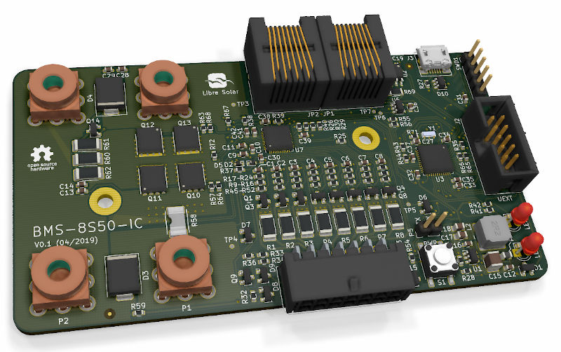

# Advanced E-bike Platform Roadmap: 
### Smart City Integration & Scalable Production Plan

*Figure 1: Our team with the latest e-bike prototype at the University of Windsor research facility*

## Prototype Evolution

### Version 1

*Figure 2: First iteration of our customized e-bike prototype, featuring initial integration of smart city technologies*

*Figure 3: Alternative view of the Version 1 prototype, highlighting the robust frame design*

### Version 2

*Figure 4: Second iteration of our e-bike prototype, showcasing improved aerodynamics and enhanced sensor integration and as lifestyle bike*

*Figure 5: Alternative view of the Version 2 prototype, demonstrating its adaptability for various use cases, including construction site transport workbike*

  
*Figure 6: Modern Open BMS (Battery Management System) prototype, under active development at our R&D lab*

## Table of Contents
- [Executive Summary](#executive-summary)
- [Our Team](#our-team)
- [Unique Value Proposition](#unique-value-proposition)
- [Production and Distribution Plan](#production-and-distribution-plan)
- [Long-term Vision](#long-term-vision)
- [Partnership Opportunities](#partnership-opportunities)
- [Next Steps](#next-steps)
- [Contact Us](#contact-us)
- [Appendix: Strategies for Securing Commitments and Funding](#appendix-strategies-for-securing-commitments-and-funding)

## Executive Summary

We have developed a cutting-edge electric two-wheeler platform that seamlessly integrates with smart city infrastructure while performing as a heavy-duty work bike. 

Our platform features:
- Advanced embedded electronics
- Custom-designed speed traction controller
- High-Performance Electronic dual motors
- RISC-V Linux infotainment SBC
- RISC-V Custom core AI Board
- Over 20 MEMS Sensors for unprecedented safety & IoT
- Vehicle-to-Anything Battery Power Inverters
- Next-generation alloys and carbon fiber construction

All components are designed, manufactured, and tested in-house, with rapid assembly and a fully vertically integrated supply chain.
High-Performance parts including 6-piston brakes, quad suspension, and lighting systems are sourced from premium European & Taiwanese Supply Partners.

We are transitioning from research to small-scale production, aiming to scale our technology and demonstrate real-world applications. 
Our Small Scale Batch production is designed to establish a B2B vertical and gather crucial data for training our AI Software stack.
We have allocated a portion of our production capacity for Friends & Family and Enthusiasts, allowing for personal development and real-world testing at our discretion.

We are actively seeking strategic partners, collaborators, and investors to help bring our electronic platform to market and increase its visibility.

### Key Highlights:
- 🚲 Innovative e-bike platform and electronic automotive chip supplier with in-house ADAS technology
- 🏙️ Smart city integration capabilities, enabling seamless communication with urban infrastructure
- 🏭 Scalable production: Current capacity of 100 bikes/year, expandable to 500/year, with the capability to supply/license 5,000 PCB boards per month to other manufacturers
- 🧑‍🔧 Local Deploy Factory: Micro-footprint Production Facility for agile manufacturing
- 🌏 Global supply chain (Taiwan, Italy, Shenzhen) ensuring quality and reliability
- 🔄 Versatile platform adaptable for multiple markets and use cases, from urban commuting to industrial applications

## Our Team
- 📊 4+ years in remote project management for solar projects across Western Canada
- 💻 10+ years of advanced PCB design, MEMS sensor consulting
- 🔬 In-house R&D through Nikola Labs electrical engineering facility
- 🤝 Collaboration with University of Windsor, Gates Corp, and APMA
- 🔌 IoT & Embedded Systems expertise

## Unique Value Proposition
1. **Smart City Integration**: Mobile urban sensors for infrastructure monitoring
2. **Advanced Driver-Assistance Systems (ADAS)**: Car-level safety for two-wheelers
3. **Licensable RISC-V Based Handlebars**: Easy upgrades and improvements
4. **Versatile Platform**: From farm utility to urban delivery services
5. **Research Ready**: Easy integration of additional sensors and electronics

## Production and Distribution Plan

| Market Segment | Target Quota | Use Case | Content Strategy | Prospect/Lead/Committed |
|----------------|--------------|----------|------------------|-------------------------|
| Smart City - Schools / Public Libraries | 10 | Community maintenance, education, accessibility | Showcase community impact, educational integration | Local government, school boards |
| Smart City - Higher Education | 10 | Engineering R&D, campus bike-share, student safety | Highlight innovation, sustainability on campus | Universities, colleges |
| Smart City - Emergency Services | 10 | Fire, Police, Forestry, EMS work bikes | Document real-life use cases, efficiency improvements | Municipal departments |
| Smart City - Municipalities | 10 | Waste management, transportation, urban maintenance | Demonstrate cost savings, environmental benefits | City councils, urban planners |
| Conservation & Eco Tourism | 5 | Animal conservatories, bird watching, guided tours | Create viral marketing content, eco-friendly initiatives | NGOs, tour companies, eco-lodges |
| High-End Custom F&F | 20 | Influencer collaborations, celebrity endorsements, Friends & Family | Luxury lifestyle showcases, exclusive events, personal testimonials | Social media influencers, athletes, celebrities, loyal supporters |
| Hospitality - Daily/Weekly Rentals | 20 | Luxury resorts, eco-lodges, urban hotels | Co-branded experiences, flexible rental programs | Hotel chains, boutique resorts, vacation rentals |
| Agriculture & Construction | 15 | Farm operations, construction site mobility | Demonstrate durability, load capacity, cost savings | Agribusinesses, construction companies |

## Long-term Vision

Our goal is to revolutionize the South Asian two-wheeler market through innovation and strategic partnerships:

1. **Market Leadership**: 
   - 🥇 Become the leading Tier 1 supplier of advanced electronic systems for two-wheelers, focusing on:
     - High-performance motor controllers
     - Advanced Driver Assistance Systems (ADAS)
     - Smart connectivity solutions

2. **Market Penetration**:
   - 📈 Target market size by 2030 in India:
     - Electric two-wheeler market: 32 million units annually
     - Two-wheeler semiconductor sales: $1 billion annually

3. **Technological Innovation**:
   - 🔬 Continuously evolve our RISC-V based designs to stay at the forefront of the industry
   - 🔗 Develop cutting-edge IoT and smart city integration capabilities
   - 🔬 Continuous development of cutting-edge ADAS features
   - 🤖 AI and ML integration for predictive maintenance and safety
   - 🌐 Expansion of IoT capabilities for smart city integration
   - 
3. **Manufacturing Excellence**:
   - 🏭 Scale from 100 bikes/year to premium small batch manufacturing
   - 🏢 Establish state-of-the-art facilities in key South Asian markets
   - 🔧 Implement Industry 4.0 practices

4. **Sustainability Impact & Leadership**:
   - 🌱 Contribute to urban decarbonization efforts worldwide
   - ♻️ Implement and promote sustainable manufacturing practices across the supply chain
   - 🔄 Develop closed-loop recycling systems for e-bike components

5. **Strategic Partnerships**:
   - 🤝 Collaborate with major automotive and tech companies to accelerate market adoption
   - 🏙️ Partner with smart city initiatives to showcase the potential of integrated urban mobility solutions
   - 🤝 Leverage existing partnership with Bangalore prototype firm
   - 🏍️ Expand collaborations with major brands (Bajaj, TVS, Hero Honda)
   - 💻 Foster relationships with tech giants for software integration

6. **Global Expansion**:
   - 🌏 Leverage success in the Indian market to expand into other emerging markets in Southeast Asia and Africa
   - 🚀 Establish our brand as a global leader in sustainable urban mobility solutions
   - 🇨🇦 Export Canadian Design Tech IP

### Key 5 year Objectives
- **Produce 100,000 Boards / month**: Supply key manufacturers, license designs to top brands
- **Expand Partnerships**: Leverage Bangalore prototype firm for investment and scaling

## Partnership Opportunities
We're seeking partners who:
- 💡 Have compelling use cases for smart, connected e-bikes
- 🏭 Can support our production goals and vision for agile manufacturing
- 🌏 Are interested in the South Asian e-mobility market
- 🚀 Want to collaborate on pioneering ADAS for two-wheelers
- 🤝 Can help expand our network

We are seeking partnerships in the following areas:
1. Smart City Integration: Collaborations with city planners and technology providers
2. Manufacturing Scale-up: Partners to help increase production capacity
3. Distribution Networks: To expand our market reach in key regions
4. R&D Collaborations: For continuous innovation in e-mobility and IoT

## Next Steps

2. Discuss potential collaboration areas
3. Explore parternshio opportunities
4. Join our pilot program for real-world testing

## Contact Us

Ready to be part of the future of urban mobility? Contact us to explore partnership opportunities:

- Email: partnerships@niko.la
- Website: www.niko.la
  
Let's revolutionize urban transportation together!

## Next Steps
📅 Schedule a 30-minute video call to explore synergies and align our technology with your strategic goals.

## Appendix: Strategies for Securing Commitments and Funding
1. Secure Letters of Intent (LOI) and Memoranda of Understanding (MOU)
2. Highlight sustainability and environmental impact
3. Emphasize job creation and local economic impact
4. Showcase technology innovations and R&D roadmap
5. Outline partnerships and collaborations
6. Detail scalability plan
7. Provide financial projections and ROI calculations
8. Define social impact metrics
9. Present risk assessment and mitigation strategies
10. Establish clear timeline and milestones

